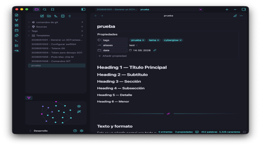

# CyberGlow

A neon cyberpunk theme for Obsidian.

---

Dark mode only. Built around a cyan and magenta palette with Xcode Midnight syntax highlighting, card layout, and deep Style Settings integration.

---

## Features

- Dark mode only -- designed for focused, late-night work
- Neon cyberpunk aesthetic with cyan (#00FFFF) and magenta (#FF00FF) accents
- Xcode Midnight color scheme for code blocks (CodeMirror 6 + Prism.js)
- Card layout with separate toggles for content, file browser, and actions panel
- 19 Style Settings options across four categories
- Compatible with the Code Styler plugin (dual selectors)
- Hidden borders, slim scrollbars, customizable tab gap
- Three background intensity presets: Abyss, Default, Elevated

---

## Screenshots

---

## Color Palette

| Role       | Hex       | Description       |
|------------|-----------|-------------------|
| Primary    | `#00FFFF` | Cyan              |
| Secondary  | `#FF00FF` | Magenta           |
| Active     | `#B2F2F4` | Light cyan accent |
| Background | `#0a0a0f` | Near-black base   |
| Card       | `#181825` | Surface / card bg |
| Text       | `#e0e0e8` | Default body text |

---

## Style Settings

Requires the [Style Settings](https://github.com/mgmeyers/obsidian-style-settings) plugin. 19 options organized into four categories:

### Colors
- Primary color (default: cyan)
- Secondary color (default: magenta)
- Active color (default: light cyan)
- Background intensity (Abyss / Default / Elevated)

### Editor
- Bold in primary color
- Italic in active color
- Headings with neon gradient

### Code Blocks
- Xcode Midnight syntax highlighting toggle

### Interface
- Hide borders
- Card layout (content, file browser, actions panel -- separate toggles)
- Card shadows
- Show / hide status bar
- Tab gap
- Floating header
- Auto-hide titlebar
- Slim scrollbars

---

## Installation

### Manual

1. Download `theme.css` and `manifest.json` from this repository.
2. In your vault, open `.obsidian/themes/` (create the folder if it does not exist).
3. Create a folder named `CyberGlow` inside `themes/`.
4. Place both files inside that folder.
5. In Obsidian, go to **Settings > Appearance > Themes** and select **CyberGlow**.

### Community Themes (coming soon)

CyberGlow will be submitted to the Obsidian community themes directory. Once approved, you will be able to install it directly from **Settings > Appearance > Themes > Browse**.

---

## Credits

Created by **DevM0nk3y**

Released under the [GPL-3.0 License](LICENSE).
